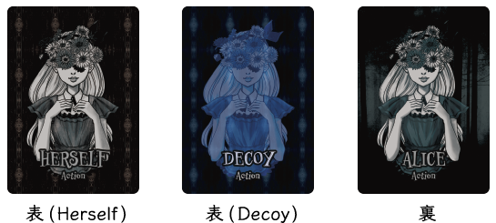
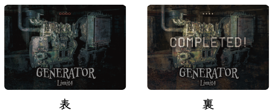

# Dead beside Decoy Rulebook

## Title

Dead beside Decoy

[https://dbd.migi.site/en/](https://dbd.migi.site/en/)

## Summary

The Killer vs. Survivors **asymmetric game**!

Can you see into the mind of a survivor and kill them all!  
Can you outsmart the killer and escape!

## Basic Information

- Number of players: 2 (~5)
- Play time: 15 minutes
- Recommended Age: 10 years and up

## Components

### Character Card

4 cards  

### Action Card

9 cards  

### Generator Card

7 cards  

### Cemetery Card

1 card

### Progress Token

28 tokens  
**画像を入れる**

### Killer Token

1 token
**画像を入れる**

## Story

A dimly lit forest where one lust killer wanders.  
Four maidens are trapped there.  
The only way to escape is to energize the door and open it.

Their life-risking escape begins now...

## Objective

In this game, one player is the killer and the other players are the survivors.  

Survivors work together to repair the generator, but if the killer finds him repairing it, he will be attacked.  
Survivors must repair the generator using a decoy to avoid detection by the killer, and the killer must see through the decoy and kill all survivors.

## Preparation

### A. Roles

Decide on one player to play the Killer.  
All other players (1 to 4) will play the the survivor.

There are four different characters (Alice, Bianca, Carrie and Dorothy) who can play the role of the survivor.  
If there is one survivor, you will be responsible for all four characters, if there are two, you will be responsible for any two characters, and if there are four, you will be responsible for one character each. (In the case of three people, one of them will be responsible for two characters, and the other two will be responsible for one character's worth.

### B. On Hand

The player playing the killer receives a **Killer Token**.

The player playing the survivor receives the **Character Card** and the **Action Cards** of the character he is assigned to.

The Character Cards must be placed in front of you, face up (without the word "injured" on them).
The Action Cards are used as your hand.

### C. On Field

Place all 7 **Generator Cards** on the field.

Put **Progress Tokens** on the side of your field and make that the Progress Token storage area.

Put **Cemetery Card** to the side of your field and make it your cemetery.

## Victory Conditions

### The Killer

**The Killer must kill all four characters** in order to win the game.

- Each character is wounded once by the killer and will die if attacked again.  
- Once a character is dead, they are excluded from the game and cannot play the Survivor Phase.

### The Suvivors

Survivors must complete repairs on **5 out of 7 generators** in order to win the game.

- Once **four** Progress Tokens are placed on a Generator Card, that generator is in repair status.  
- Each generator is limited to a maximum number of Progress Tokens per round.
  - 4: 2 cards, 3: 2 cards, 2: 2 cards, 1: 1 card
- When the generator is in a repaired state, the killer may not interfere with the repairs, described below.

## Game Progress

The following two phases, **A. Action Phase** and **B. Processing Phase**, are used as one round, and the round repeats until either the killer or the survivors gets the victory condition.

### A. Action Phase

In the Action Phase, play **A-1. Survivor Action** and then play **A-2. Killer Action**.

#### A-1. Survivor Action

**Note: If a character is killed, he cannot perform actions in the Survivor Phase. **

Each player playing the survivor places his character's Action Card face down (so that you can't tell whether it's "Herself" or "Decoy") on the Generator Card in any order.

Only the generator on which you placed "Herself" will be able to repair that generator.  
Keep in mind, however, that if the generator on which "Herself" was placed is attacked by a killer, she may be injured or killed.

If there is more than one player playing the role of the survivor, they may choose which Action Card to place on the generator, but make sure the Killer doesn't find out.

#### A-2. Killer Action

The player playing the Killer should choose which Generator Card to go explore and place the Killer Token on it.
(A Generator Card that is already in a state of repair cannot be selected.)

### B. Processing Phase

In the Processing Phase, perform **B-1. Killer Processing** and then perform **B-2. Repair Processing**.

#### B-1. Killer Processing

First, turn up all the Action Cards on the Generator Card where the Killer Token was placed.

At this point, the Killer can choose one of the following actions "**Jamming the Generator**" or "**Attack the character**".
##### Damage the Generator

You can reduce the repair progress of the generator you are going explore by one.

Remove one Progress Token on the relevant Generator Card and return it to the Progress Token storage area.

##### Attack the character

This action is only possible if "Herself" is included on the revealed Action Card.

You can choose to attack one of the "Herself" characters on the generator you are going explore. (Even if there is more than one "Herself", you can only attack one "Herself".

The attacked character will be in an injured state.
Turn the Character Card over to the "injured" state.
If a character in the "injured" state is attacked, she dies immediately and cannot place Action Cards in the Survivor Phase after the next round.

Place the character and Action Cards of the deceased character on top of the Cemetery Card.

**If all characters are dead at this time, the Killer wins**.
#### B-2. Repair Processing

Turn over all placed Action Cards placed on the generator.

Place Progress Tokens on the Generator Card where the "Herself" was placed, for the number of those "Herself" cards **not exceeding the generator's repair limit**.

However, if the Killer select "Damage the Generator" in "B-1. Killer Proccesing", that generator cannot be repaired and you cannot place a Progress Token on it, even if it has "Herself".

Also, if the Killer select "Attack the Character" in "B-1. Killer Proccesing", you can place as many Progress Tokens as the number of "Herself" (not exceeding the generator's repair limit), excluding the character that was attacked.

If you place 4 or more Progress Tokens on a single Generator Card, the generator is in Repair Complete condition.  
Turn over the repaired Generator Card when it is in the repaired state.

**If 5 or more generators are in a repaired state at this time, the survivor wins**.


## FAQ

### With two "Herself" cards on a generator explored by the killer, the killer has chosen to attack my character. Can I place a Progress Token on that generator?

You can.  
You can place a Progress Token on a character when the killer chooses to attack the character, for the number of "Herself" other than the character he attacked, but not more than the generator's repair limit.

### With two "Herself" cards on the generator the killer explored, the killer chose to damage the repair of the generator. Can I place a Progress token on that generator minus one?

You cannot.  
When a killer chooses to damage the generator, no matter how many "Herself" there are, you cannot place a Progress Token on that generator.

### The title of this game is similar to something other game, Right?

Uh huh.

## Desingers

### Game Designer

Takanobu Migitera
[@migi](https://twitter.com/migi)

### Graphic Designer

maasa
[@i_maasa](https://twitter.com/i_maasa)

### Character Designer

serikiyo
[Key-iro](https://keyiro.stores.jp/)

## Version history

- ver1.0.0 (2020/10/05)
  - release