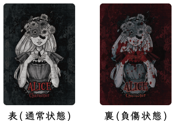
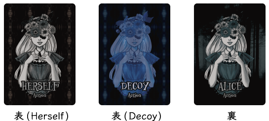
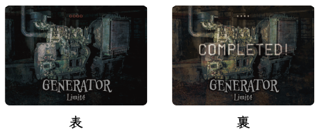
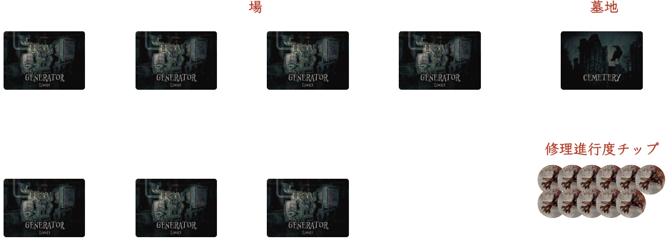
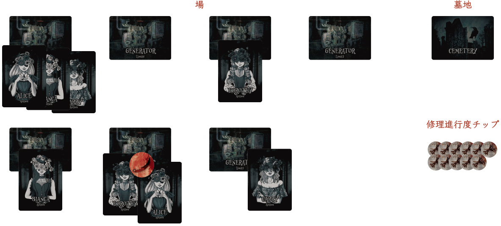

# Dead beside Decoy ルールブック

## タイトル

Dead beside Decoy (デッド・ビサイド・デコイ)

[https://dbd.migi.site](https://dbd.migi.site)

## ゲーム概要

殺人鬼vs生存者の**非対称型対戦ゲーム**！  

生存者の**心理を見抜き**、皆殺しにできるか！？  
殺人鬼の**裏をかいて**、脱出できるか！？  

## 基本情報

- プレイ人数: 2（〜5）人
- プレイ時間: 15分
- 推奨年齢: 10歳以上

## セット内容

### キャラクターカード

計4枚  

### アクションカード

計8枚  

### 発電機カード

計7枚  

### 墓地カード

1枚

### 修理進行度チップ

28枚  

### 殺人鬼チップ

1枚

## ストーリー

1人の快楽殺人者が彷徨う薄暗い森。  
そこに囚われた4人の乙女たち。  
脱出する手段は扉を通電させて開くことのみ。

命を懸けた逃走劇がいま始まる……。

## ゲームの目的

このゲームはプレイヤーの1人が殺人鬼、そのほかのプレイヤーが生存者となってそれぞれの立場で勝利条件を目指すゲームです。  
生存者側は協力して発電機の修理を進めていきますが、修理しているところを殺人鬼に見つかってしまうと攻撃されてしまいます。  
生存者はデコイ（おとり）を使いながら殺人鬼にバレないように発電機を修理し、また殺人鬼はデコイを見破りつつ生存者を全滅させましょう。

## ゲームの準備

### A. 役割分け

任意の手段で殺人鬼役のプレイヤーを1人決めてください。  
殺人鬼役以外のプレイヤー（1〜4人）はすべて生存者役となります。

生存者役のキャラクターは「Alice」「Bianca」「Carrie」「Dorothy」の4種類が存在します。  
生存者役が1人の場合は4キャラクター分すべてを、2人の場合は任意の2キャラクター分ずつを、4人の場合は1キャラクター分ずつを担当します。（3人の場合は誰か1人が2キャラクター分を担当し、それ以外の2人は1キャラクター分を担当します）

### B. 各プレイヤーの手元に用意するもの

殺人鬼役のプレイヤーは**殺人鬼チップ**を受け取ります。

生存者役のプレイヤーは自分が担当するキャラクターの**キャラクターカード**と**アクションカード**を受け取ります。

キャラクターカードは表を上にして（「injured」と描かれていない面を上にして）自分の前に置いてください。
アクションカードは手札とします。

### C. 場に用意するもの

**発電機カード**を7枚すべて場に並べてください。

**修理進行度チップ**を場の横に置いて、そこを修理進行度チップ置き場としてください。

**墓地カード**を場の横に置いて、そこを墓地としてください。

#### 参考: ゲーム開始時の配置

## ゲームの勝利条件

### 殺人鬼の勝利条件

**4人のキャラクターをすべて死亡させる**ことが殺人鬼の勝利条件となります。

- 各キャラクターは殺人鬼から一度攻撃されると負傷状態となり、その状態で再度攻撃されると死亡します。  
- 死亡したキャラクターはゲームから除外され、生存者フェイズをおこなうことができなくなります。

### 生存者の勝利条件

7つの発電機のうち**5つの発電機の修理を完了する**ことが生存者の勝利条件となります。

- 発電機カード上に修理進行度チップが**4枚**置かれるとその発電機は修理完了状態となります。  
- 各発電機には1ラウンド内で修理進行度チップを置ける最大枚数が設定されています。
  - 4: 2枚、3: 2枚、2: 2枚、1: 1枚
- 修理完了状態となった発電機に対して、殺人鬼は後述の修理の妨害をおこなうことはできません。

## ゲームの進行

下記の「**A. アクションフェイズ**」「**B. 処理フェイズ**」の2つのフェイズを1ラウンドとして、殺人鬼と生存者のいずれかが勝利条件を満たすまでラウンドを繰り返します。

### A. アクションフェイズ

アクションフェイズでは「**A-1. 生存者のアクション**」をおこなったあと「**A-2. 殺人鬼のアクション**」をおこないます。

#### A-1. 生存者のアクション

**注: キャラクターが死亡していた場合はそのキャラクターは生存者フェイズでアクションをおこなうことはできません。**

生存者役のプレイヤーはそれぞれ、任意の順番で自分のキャラクターのアクションカードを裏向き（「Herself」か「Decoy」かがわからないように）にして発電機カードの上に置いていきます。

「Herself」を置いた発電機のみ、その発電機の修理を進めることができます。  
ただし「Herself」を置いた発電機が殺人鬼に攻撃されると負傷・死亡してしまう可能性があることに注意してください。

生存者役のプレイヤーが複数いる場合はどちらのアクションカードをどの発電機カードに置くかを相談しても構いませんが、殺人鬼役のプレイヤーにバレないようにおこないましょう。

#### A-2. 殺人鬼のアクション

殺人鬼役のプレイヤーはどの発電機カードを探索しに行くかを選択し、その上に殺人鬼チップを置いてください。
（ただし、すでに修理完了状態となっている発電機カードは選択できません。）

#### 参考: アクションフェイズ終了時の配置

### B. 処理フェイズ

処理フェイズでは「**B-1. 殺人鬼の処理**」をおこなったあと「**B-2. 修理の処理**」をおこないます。

#### B-1. 殺人鬼の処理

まず、殺人鬼チップが置かれた発電機カード上のアクションカードをすべて表にします。

この際、殺人鬼は「**発電機の修理を妨害する**」「**キャラクターを攻撃する**」の**いずれか1つの行動**を選択できます。

##### 発電機の修理を妨害する場合

探索対象の発電機の修理進行度を1つ減らすことができます。

該当の発電機カード上の修理進行度チップを1枚取り除いて修理進行度チップ置き場に戻してください。

##### キャラクターを攻撃する場合

表にしたアクションカードに「Herself」が含まれていた場合のみ可能な行動です。

探索対象の発電機に置かれている「Herself」のキャラクター1人を選択して攻撃することができます。（複数の「Herself」があったとしても攻撃できるのは1人だけです）

攻撃されたキャラクターは傷を負った状態になります。
キャラクターカードを裏返して「injured」状態にしてください。
もし「injured」状態のキャラクターが攻撃された場合は、即座に死亡し、次ラウンド以降は生存者フェイズでアクションカードを配置することはできません。

死亡したキャラクターのキャラクターカードとアクションカードは墓地カードの上に置いてください。

**このタイミングですべてのキャラクターが死亡していた場合、殺人鬼の勝利となります**
#### B-2. 修理の処理

殺人鬼が探索した発電機以外の発電機に置かれた置かれたアクションカードをすべて表にします。

「Herself」が置かれていた発電機カードの上にその「Herself」の枚数だけ**発電機の修理制限枚数を超えない範囲で**修理進行度チップを置いてください。

ただし「B-1. 殺人鬼の処理」で殺人鬼が「発電機の修理を妨害する」を選択していた場合、その対象となった発電機は修理を進めることができず「Herself」があったとしても修理進行度チップを置くことはできません。

また「B-1. 殺人鬼の処理」で殺人鬼が「キャラクターを攻撃する」を選択していた場合、対象となった発電機にその攻撃されたキャラクター以外にも「Herself」が置かれていた場合は（発電機の修理制限枚数を超えない範囲で）修理進行度チップを置くことができます。

1つの発電機カード上に4枚以上の修理進行度チップが置かれると、その発電機は修理完了状態となります。

**このタイミングで5つ以上の発電機が修理完了状態になっていた場合、生存者の勝利となります**

## FAQ

### 殺人鬼が探索した発電機に「Herself」が2枚ある状態で、殺人鬼はキャラクターの攻撃を選択しました。修理進行度チップをその発電機に1枚置くことはできますか？

できます。  
殺人鬼がキャラクターの攻撃を選択した際にその攻撃したキャラクター以外の「Herself」の枚数だけ、発電機の修理制限枚数を超えない範囲で修理進行度チップを置くことはできます。

### 殺人鬼が探索した発電機に「Herself」が2枚ある状態で、殺人鬼は発電機の修理の妨害を選択しました。修理進行度チップをその発電機に差し引き1枚置くことはできますか？

できません。  
殺人鬼が発電機の修理の妨害を選択した際には、そこに何枚の「Herself」があろうとも、その発電機に修理進行度チップを置くことはできません。

### タイトルが何かのゲームっぽくないですか？

そうですね。

## デザイナー

### ゲームデザイナー

右寺 隆信
[@migi](https://twitter.com/migi)

### グラフィックデザイナー

maasa
[@i_maasa](https://twitter.com/i_maasa)

### キャラクターデザイナー

serikiyo
[Key-iro](https://keyiro.stores.jp/)

## バージョン履歴

- ver1.0.0 (2020/10/5)
  - 公開　